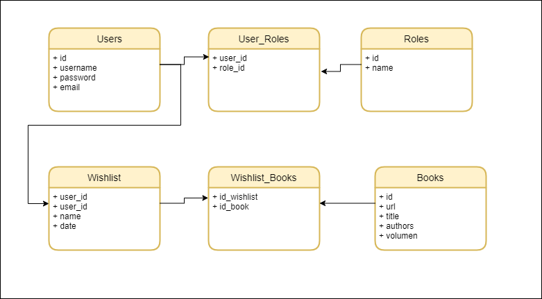
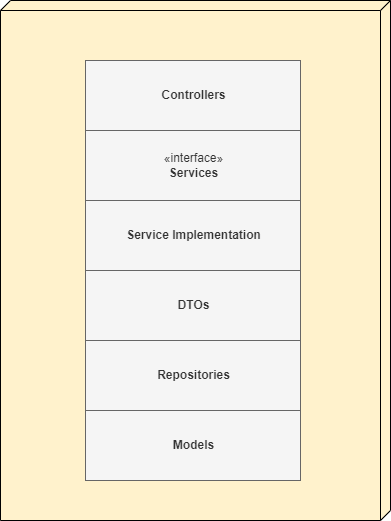
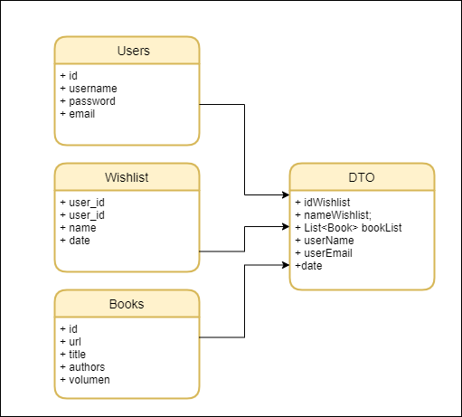
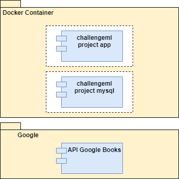

# Challege Mercado Libre
El presente ilustra el **diseño de la solución** y los pasos requeridos para poder correr la solución.

## Diseño de la Solución:
Se crea un ecosistemas de **APIs** con **Spring Boot** siguiendo un modelo en capas y patrón DTO, haciendo uso de una base de datos **MySQL**. La solución se habilita para que pueda ser deplegada dentro de un contenedor **Docker**.

**Diagrama Entidad Relación**
A continuación se ilustra el diagrama de entidad relación que define el modelo de datos de la solucuión:

Se definen las tablas User, Roles para la gestión de los usuarios de la aplicación y en donde se almacena de forma segura las credenciales de autenticación. El resto de tablas soportan la solución del challenge.

**Diagrama de Clases Alto Nivel**
El siguiente diagrama ilustra los packages y clases definidas para dar solución al reto:

**Patrón DTO:**
El uso del patrón DTO permite optimizar el esfuerzo de desarrollo para ofrecer APIs que encierren a las entidades Wishlist, Books, User en un mismo servicio.

**Diagrama de Compoentes Alto Nivel:**
Por medio de este diagrama es posible ver el encapsulado de los componentes que se defienen para la solución.

## Despliegue de la solución:
**1** Hacer Git Clone de la solución.
**2** Hacer Git Clone de la solución.